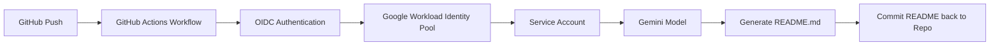

# Setup Guide — Auto README Generator using Gemini + GitHub Actions + GCP Workload Identity

## Overview

This project automatically generates a `README.md` file using Gemini models whenever code is pushed to the repository.

Authentication is handled securely using:

* Google Cloud Workload Identity Federation
* GitHub Actions OIDC authentication
* Service Account based access
* No API keys

---

# Architecture



---

# Prerequisites

Before starting, ensure you have:

* Google Cloud Project
* Billing enabled
* Vertex AI API enabled
* GitHub repository
* `gcloud` CLI installed locally
* Python 3.11+

---

# Step 1 — Create Google Cloud Project

```bash
gcloud projects create game-d8160
```

Set active project:

```bash
gcloud config set project game-d8160
```

---

# Step 2 — Enable Required APIs

Enable required services:

```bash
gcloud services enable \
  aiplatform.googleapis.com \
  iamcredentials.googleapis.com \
  sts.googleapis.com \
  iam.googleapis.com
```

Wait a few minutes for APIs to propagate.

---

# Step 3 — Create Service Account

```bash
gcloud iam service-accounts create readme-gen-sa \
  --display-name="README Generator Service Account"
```

Service account email:

```text
readme-gen-sa@game-d8160.iam.gserviceaccount.com
```

---

# Step 4 — Grant IAM Roles

Grant Vertex AI access:

```bash
gcloud projects add-iam-policy-binding game-d8160 \
  --member="serviceAccount:readme-gen-sa@game-d8160.iam.gserviceaccount.com" \
  --role="roles/aiplatform.user"
```

Grant service usage access:

```bash
gcloud projects add-iam-policy-binding game-d8160 \
  --member="serviceAccount:readme-gen-sa@game-d8160.iam.gserviceaccount.com" \
  --role="roles/serviceusage.serviceUsageConsumer"
```

---

# Step 5 — Create Workload Identity Pool

```bash
gcloud iam workload-identity-pools create github-pool \
  --location="global" \
  --display-name="GitHub Pool"
```

Get project number:

```bash
PROJECT_NUMBER=$(gcloud projects describe game-d8160 --format="value(projectNumber)")
```

---

# Step 6 — Create Workload Identity Provider

Replace:

* `YOUR_GITHUB_USERNAME`
* `YOUR_REPO_NAME`

```bash
gcloud iam workload-identity-pools providers create-oidc github-provider \
  --location="global" \
  --workload-identity-pool="github-pool" \
  --display-name="GitHub Provider" \
  --issuer-uri="https://token.actions.githubusercontent.com" \
  --attribute-mapping="google.subject=assertion.sub,attribute.repository=assertion.repository" \
  --attribute-condition="assertion.repository=='YOUR_GITHUB_USERNAME/YOUR_REPO_NAME'"
```

---

# Step 7 — Allow GitHub to Use Service Account

```bash
gcloud iam service-accounts add-iam-policy-binding \
  readme-gen-sa@game-d8160.iam.gserviceaccount.com \
  --role="roles/iam.workloadIdentityUser" \
  --member="principalSet://iam.googleapis.com/projects/${PROJECT_NUMBER}/locations/global/workloadIdentityPools/github-pool/attribute.repository/YOUR_GITHUB_USERNAME/YOUR_REPO_NAME"
```

---

# Step 8 — Install Python Dependencies

## requirements.txt

```txt
google-genai>=1.30.0
google-auth>=2.35.0
```

Install locally:

```bash
pip install -r requirements.txt
```

---

# Step 9 — README Generator Script

## readme_gen.py

````python
import os
from google import genai

PROJECT_ID = os.environ.get("GCP_PROJECT_ID", "game-d8160")
REGION = os.environ.get("GCP_REGION", "global")

MODEL_NAME = "gemini-2.5-flash"

client = genai.Client(
    vertexai=True,
    project=PROJECT_ID,
    location=REGION,
)

SKIP_DIRS = {
    "node_modules",
    ".git",
    "__pycache__",
    ".venv",
    "dist",
    "build",
}

EXTENSIONS = {
    ".py",
    ".js",
    ".ts",
    ".go",
    ".java",
    ".yaml",
    ".yml",
    ".json",
    ".toml",
    ".md",
    ".sh",
}


def read_repo_files(repo_path: str, max_files: int = 20) -> str:

    collected = []

    for root, dirs, files in os.walk(repo_path):

        dirs[:] = [d for d in dirs if d not in SKIP_DIRS]

        for fname in files:

            if fname.lower() == "readme.md":
                continue

            if any(fname.endswith(ext) for ext in EXTENSIONS):

                fpath = os.path.join(root, fname)
                rel_path = os.path.relpath(fpath, repo_path)

                try:
                    with open(
                        fpath,
                        "r",
                        encoding="utf-8",
                        errors="ignore",
                    ) as f:

                        content = f.read()[:3000]

                    collected.append(
                        f"### {rel_path}\n"
                        f"```\n{content}\n```"
                    )

                except Exception:
                    continue

            if len(collected) >= max_files:
                break

    return "\n\n".join(collected)


def generate_readme(repo_path: str = ".") -> str:

    code_context = read_repo_files(repo_path)

    prompt = f"""
You are a senior technical writer.

Generate a professional README.md.

Include:
- Project Name
- Description
- Features
- Tech Stack
- Installation
- Usage
- Project Structure
- License

Return ONLY markdown.

Source Code:
{code_context}
"""

    response = client.models.generate_content(
        model=MODEL_NAME,
        contents=prompt,
    )

    return response.text


if __name__ == "__main__":

    import sys

    path = sys.argv[1] if len(sys.argv) > 1 else "."

    readme = generate_readme(path)

    with open("README.md", "w", encoding="utf-8") as f:
        f.write(readme)

    print("README generated successfully")
````

---

# Step 10 — GitHub Actions Workflow

Create:

```text
.github/workflows/readme.yml
```

```yaml
name: Auto-generate README

on:
  push:
    branches:
      - main

    paths-ignore:
      - 'README.md'
      - '.github/**'

permissions:
  contents: write
  id-token: write

jobs:
  generate-readme:
    runs-on: ubuntu-latest

    env:
      GCP_PROJECT_ID: game-d8160
      GCP_REGION: global

    steps:

      - name: Checkout repository
        uses: actions/checkout@v4

      - name: Authenticate to Google Cloud
        uses: google-github-actions/auth@v2
        with:
          workload_identity_provider: projects/PROJECT_NUMBER/locations/global/workloadIdentityPools/github-pool/providers/github-provider
          service_account: readme-gen-sa@game-d8160.iam.gserviceaccount.com

      - name: Setup Python
        uses: actions/setup-python@v5
        with:
          python-version: "3.11"

      - name: Install dependencies
        run: |
          python -m pip install --upgrade pip
          pip install -r requirements.txt

      - name: Generate README
        run: |
          python readme_gen.py .

      - name: Commit README
        uses: stefanzweifel/git-auto-commit-action@v5
        with:
          commit_message: "docs: auto-update README [skip ci]"
          file_pattern: README.md
```

---

# Step 11 — Push Code

```bash
git add .
git commit -m "setup auto readme generator"
git push origin main
```

GitHub Actions should:

1. Authenticate to GCP
2. Access Gemini models
3. Generate README
4. Commit README back to repo

---

# Troubleshooting

## Permission Denied

Ensure service account has:

```text
roles/aiplatform.user
roles/serviceusage.serviceUsageConsumer
```

---

## Model Not Found

Use:

```text
global
```

instead of:

```text
us-central1
```

---

## Vertex AI SDK Deprecated Warning

Use:

```python
from google import genai
```

instead of:

```python
import vertexai
```

---

# Recommended Models

| Model                 | Usage                           |
| --------------------- | ------------------------------- |
| gemini-2.5-flash      | Best balance of speed + quality |
| gemini-2.5-pro        | Higher quality generation       |
| gemini-2.5-flash-lite | Cheapest + fastest              |

---

# Final Result

You now have:

* Secure OIDC authentication
* No API keys
* GitHub Actions integration
* Gemini-powered README generation
* Fully automated documentation updates
